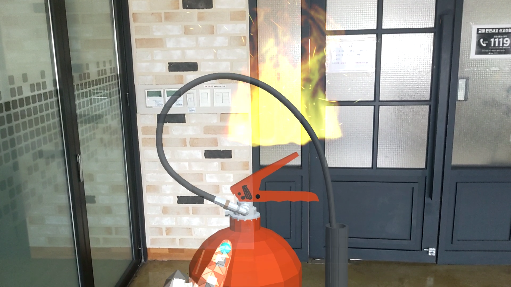
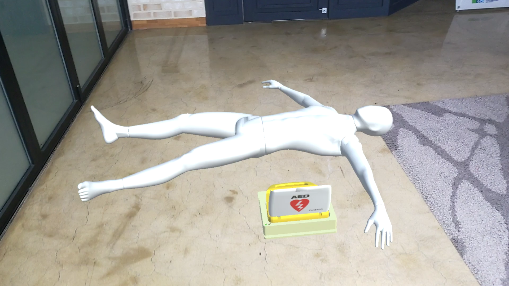
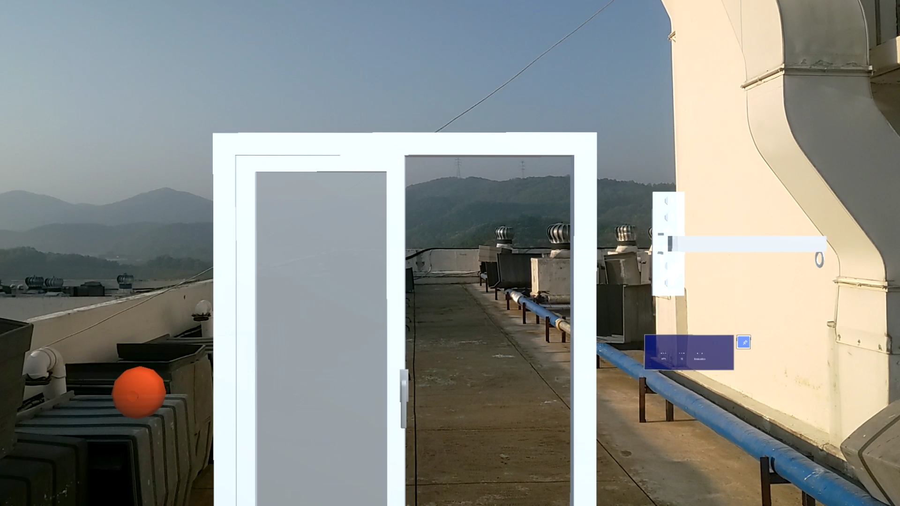

# AR application development for fire safety education
# AR을 활용한 소방안전교육 콘텐츠

## Description  
Microsoft의 Hololens2로 개발한 소방안전 교육 콘텐츠로 소화, 응급처치, 통보 및 피난을 교육한다.  
소화기와 AED, 완강기 사용법을 학습한다.  

## Screenshots
소화 시뮬레이션

응급처치 시뮬레이션

통보 및 피난 시뮬레이션

## How to Play
메뉴에서 콘텐츠를 선택할 수 있다.  
소화 시뮬레이션에서는 소화기 사용법을 훈련한다.  
응급처치 시뮬레이션에서는 AED 사용법을 훈련한다.  
통보 및 피난 시뮬레이션에서는 피난시 행동요령과 완강기 사용법을 훈련한다.  

## version
Unity 2020.2020.30f1  
MRTK Version 2.7.3.0  

## research paper
AR을 활용한 소방안전교육 콘텐츠 